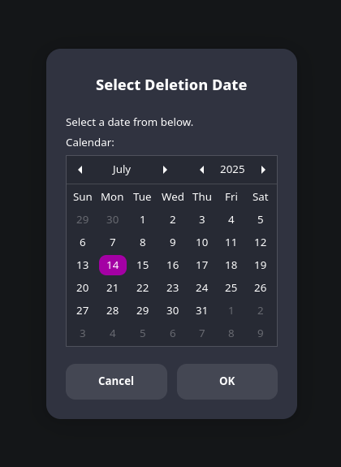
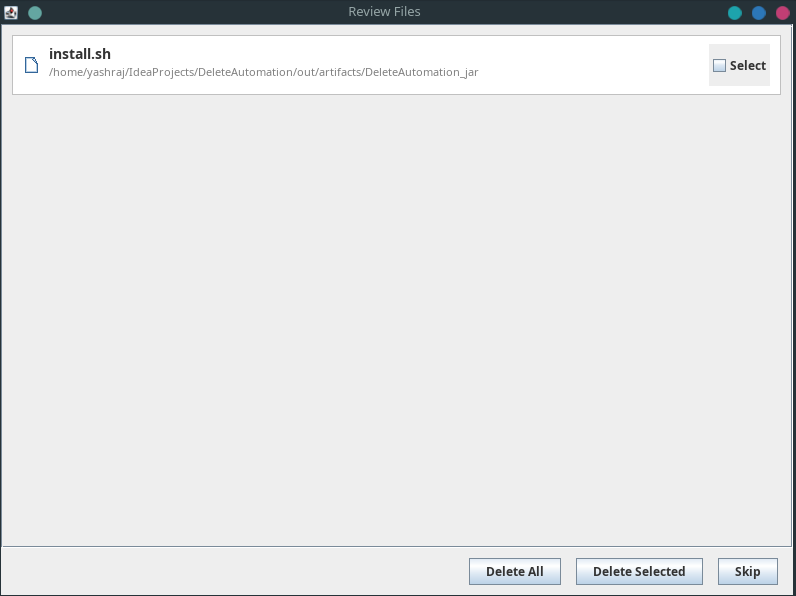

# 🗑️ AutoDelete – Smart File Self-Destruct Scheduler

AutoDelete is a lightweight desktop tool that lets you **schedule automatic deletion of files** at a future date.  
Ideal for receipts, temporary files, screenshots, or anything you don’t want to linger forever.

---

## ✨ Features

- 🗓️ **Schedule deletions** using a calendar date picker (right-click menu)
- 🔔 **Reminder notifications** for due deletions at login
- 🖥️ **GUI review panel** to choose which files to delete or skip
- 💣 **Permanent delete** option (bypasses trash)
- 📁 **KDE Dolphin + GNOME Nautilus integration**
- 📦 Simple local installer (no sudo or system-wide installation required)

---

## 📸 Screenshots

| Date Picker                    | Review GUI                   |
|--------------------------------|------------------------------|
|  |  |

---

## 🛠️ Installation (Linux)

Download the latest release `.zip` or `.tar.gz` and run:

```bash
bash install.sh
